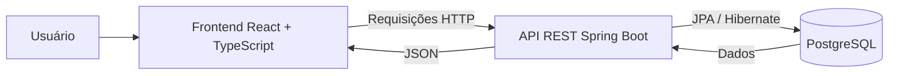

# Arquitetura da Solução

## Visão geral

O sistema utiliza uma arquitetura dividida em três partes:

1. Frontend desenvolvido com React e TypeScript.
2. Backend desenvolvido com Java e Spring Boot.
3. Banco de dados PostgreSQL executado em Docker.

## Diagrama



## Frontend

Responsável pela interface e interação com o usuário.

Principais tecnologias:

- React
- TypeScript
- Vite
- TanStack Query
- React Hook Form
- Zod
- React Router

O frontend realiza requisições HTTP para a API REST e atualiza a interface após operações de cadastro, consulta, edição e exclusão.

## Backend

Responsável pelas regras da aplicação e pelo acesso aos dados.

Principais tecnologias:

- Java 21
- Spring Boot
- Spring Data JPA
- Hibernate
- Maven

O backend recebe as requisições do frontend, processa as operações e utiliza JPA/Hibernate para persistir os dados.

## Banco de dados

O PostgreSQL armazena:

- Concessionárias
- Veículos
- Associação entre veículos e concessionárias

O banco é executado em contêiner Docker por meio do Docker Compose.

## Fluxo de uma operação

```text
Usuário
  -> Frontend
  -> API REST
  -> Camada de serviço
  -> Repositório JPA
  -> PostgreSQL
  -> Resposta JSON
  -> Atualização da interface
```
